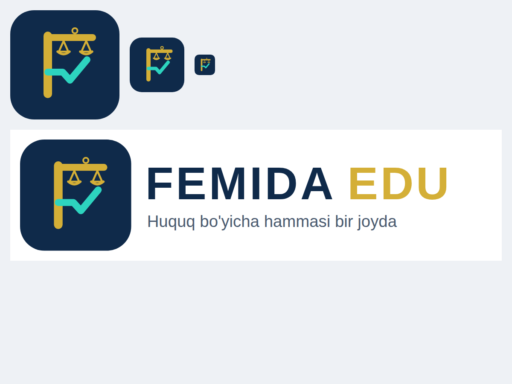

# Femida Edu — brend qarorlari

> Holat: **qaror qabul qilingan, ro'yxatdan o'tkazilmagan.** Domen, bot va tovar belgisi hali olinmagan.
> So'rovnoma: `data/v3/polls.json`, 62–69.

## Nom

| | Qaror |
|---|---|
| Brend | **Femida Edu** (logoda FEMIDA EDU, texnik nom `femidaedu`) |
| Nega "Femida+" emas | "+" domen, Telegram username va heshtegda ishlamaydi (`femidaplus` bo'lib qoladi, Pinterest'da shunday hisob bor); "Edu" ta'lim platformasi ekanini aytadi va 45-sinfdagi (huquqiy xizmatlar) "Femida" firmalaridan ajratadi |
| A+ Huquq | "Femida Edu — Sertifikat" yo'nalishi nomi sifatida qoladi, asta yo'qoladi |
| Yuridik shaxs | O'zgarmaydi: "Femida Edu — YURISTIM TEAM MChJ mahsuloti". Payme — DOYSE kassasi orqali |
| Shior | "Huquq bo'yicha hammasi bir joyda" |

## Logo va ranglar

- Belgi (`public/brand/femida-edu-mark.svg`): **F** harfi. Tepa chizig'i — halqaga osilgan tarozi shayini, ikki palla.
  O'rta chizig'i — **to'g'ri javob belgisi (✓)**. Huquq + test/ta'lim.
- To'liq logo: `public/brand/femida-edu-logo.svg`.
- Bu — **eskiz**. Ro'yxatdan o'tkazishdan oldin dizayner vektorini tozalashi va kichik o'lchamda (16–32 px) soddalashtirishi kerak:
  48 px da pallalar deyarli ko'rinmaydi, favicon uchun faqat F + ✓ versiyasi kerak.

| Token | Rang | Qayerda |
|---|---|---|
| `--brand` | `#0F2A4A` to'q ko'k | fon, sarlavhalar |
| `--accent` | `#D4AF37` oltin | belgi, "EDU", Premium |
| `--success` | `#2DD4BF` firuza | to'g'ri javob, progress |

## Domen va Telegram

Tekshiruv (2026-09-30, `npm run brand:check` — DNS so'rovi):

| Nom | Natija |
|---|---|
| femida.uz | **Band** (NS: beget) |
| **femidaedu.uz** | DNS'da yozuv yo'q — **bo'sh bo'lishi mumkin** |
| femidaedu.com | DNS'da yozuv yo'q — bo'sh bo'lishi mumkin |
| @FemidaEduBot | Tekshirib bo'lmadi (bu muhitda t.me yopiq) |

DNS'da yozuv yo'qligi domen bo'sh degani emas (ro'yxatdan o'tgan, lekin sozlanmagan bo'lishi mumkin).
**Yakuniy tekshiruv:** femidaedu.uz — .uz registratorlaridan birining saytida; @FemidaEduBot — @BotFather'da `/newbot`.
O'z kompyuteringizda: `npm run brand:check` (Telegram tekshiruvi ham ishlaydi).

## Tovar belgisi (patent emas)

Nom va logo **patent qilinmaydi** — ular **tovar belgisi** sifatida O'zbekiston Intellektual mulk agentligida
ro'yxatdan o'tkaziladi. Platforma kodi — alohida, EHM dasturi sifatida guvohnoma olishi mumkin.

| Sinf (MKTU) | Nima uchun |
|---|---|
| 9 | Dastur, mobil ilova |
| 41 | Ta'lim, test o'tkazish, sertifikat berish — **asosiy sinf** |
| 42 | Onlayn platforma (SaaS) |
| 45 | Huquqiy ma'lumot xizmatlari — ixtiyoriy; "Femida" nomli yuridik firmalar bilan to'qnashuv xavfi shu yerda eng katta |

Tartib:
1. Agentlik bazasida "Femida" va "Femida Edu" bo'yicha qidiruv (41, 42, 9, 45-sinflar).
2. Belgi turi: **kombinatsiyalangan** (so'z + tasvir). Yakka "FEMIDA" so'zi zaif (O'zbekistonda kamida
   "FEMIDA-TRUST", "FEMIDA YURIDIK XIZMAT", "FEMIDA FINANCE", "Farm Femida" bor).
3. Ariza, boj to'lovi, ekspertiza. Joriy bojlar va muddatlarni agentlik yoki patent vakilidan aniqlang.
4. Ro'yxatdan o'tgach — ® belgisi; ungacha ™ ishlatish mumkin.

## Kodda qayta nomlash (keyingi qadam)

A+ Huquq nomi ~11 faylda: sayt nomi, `manifest.ts`, `logo.tsx`, maxfiylik va shartlar sahifalari, bot matnlari.
Qo'shimcha: `NEXT_PUBLIC_SITE_URL`, bot tokeni (yangi @FemidaEduBot), Vercel domeni, Supabase Auth redirect URL'lari,
Google OAuth redirect. Hozirgi foydalanuvchilarni yo'qotmaslik uchun eski domendan yangisiga 301 yo'naltirish.
