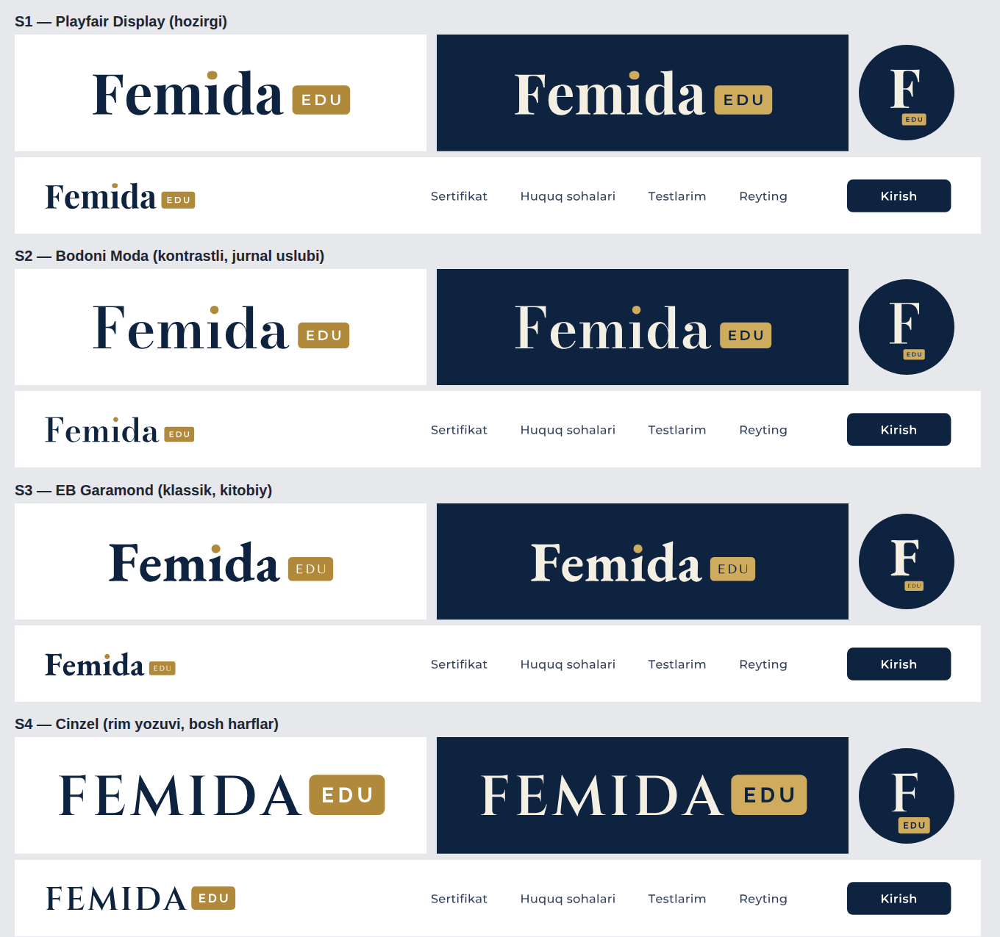

# Femida Edu — brend qarorlari

> **Yakuniy: logo — S1** (Playfair Display "Femida", oltin "i" nuqtasi, oltin nishonchadagi EDU) — `src/components/logo.tsx`.
> Avatar va ilova ikonkasi — tarozi tutgan Femida haykali (oltin siluet, to'q ko'k fon), favicon — oltin nuqtali F.
> Femida Edu — A+ Huquq'dan alohida mahsulot (so'rovnoma 70–93).
>
> Holat: **qaror qabul qilingan, ro'yxatdan o'tkazilmagan.** Domen, bot va tovar belgisi hali olinmagan.
> So'rovnoma: `data/v3/polls.json`, 62–69.

## Nom

| | Qaror |
|---|---|
| Brend | **Femida Edu** (logoda FEMIDA EDU, texnik nom `femidaedu`) |
| Nega "Femida+" emas | "+" domen, Telegram username va heshtegda ishlamaydi (`femidaplus` bo'lib qoladi, Pinterest'da shunday hisob bor); "Edu" ta'lim platformasi ekanini aytadi va 45-sinfdagi (huquqiy xizmatlar) "Femida" firmalaridan ajratadi |
| A+ Huquq | "Femida Edu — Sertifikat" yo'nalishi nomi sifatida qoladi, asta yo'qoladi |
| Yuridik shaxs | O'zgarmaydi: "Femida Edu — YURISTIM TEAM MChJ mahsuloti". Payme — DOYSE kassasi orqali |
| Shior | "Huquq bo'yicha hammasi bir joyda" |

## Logo va ranglar

**Qaror: logo belgisiz, faqat matnli (wordmark). Tanlangan uslub — W10:** Playfair Display'da "Femida",
yuqori o'ngda kichik EDU (Montserrat). Shu uslubdagi 9 variant (P1–P9), 6 rang va qo'llanish namunalari
(sayt sarlavhasi, Telegram avatari, favicon, vizitka, soha sertifikati) — `public/brand/final/`,
`docs/brand-w10.png`, qayta yaratish: `scripts/brand-w10.mjs`.

**Keyingi qadam:** P7 (oltin "i" nuqtasi), EDU pastga — 4 joylashuv (Q1–Q4, `docs/brand-p7-edu-past.png`,
`scripts/brand-p7.mjs`).

**Egasi R3 ni tanladi:** "Femida" + oltin nishonchadagi EDU, yonma-yon. 4 shriftda (S1 Playfair, S2 Bodoni,
S3 EB Garamond, S4 Cinzel) — `public/brand/final/r3/`, `docs/brand-r3-shriftlar.png`, `scripts/brand-r3.mjs`.

Belgili variantlar (A–N) rad etildi.
10 ta matnli variant — `public/brand/wordmarks/` (W1–W10), hammasi bir xil ranglarda, farq faqat tipografiyada;
avatar/favicon uchun har birining qisqa shakli (F, FE, f/ …) bor. Qayta yaratish: `scripts/brand-wordmarks.mjs`.

Rad etilgan belgili variantlar (tarix)

Birinchi eskiz ("F" + ✓, yumaloq shrift) rad etildi — o'yinchoq ko'rinish. Yangi 6 variant (`public/brand/variants/`),
hammasida matn vektor yo'lga aylantirilgan (shrift o'rnatilmagan qurilmada ham bir xil ko'rinadi):

| | Belgi | Shrift |
|---|---|---|
| A — Muhr | Ikki doira ichida F monogramma | Cinzel (rim yozuvi) + Montserrat |
| B — Tarozi | Nafis chiziqli tarozi, doira | Cormorant Garamond + Montserrat |
| C — Zamonaviy | Geometrik F, o'rta chiziq oltin | Montserrat |
| D | C belgisi | Cinzel + Montserrat |
| E | Tarozi, yumaloq kvadrat | Cinzel + Montserrat |
| F — Qalqon | Qalqon ichida F | Cinzel (belgi) + Cormorant Garamond |

**2-to'plam (G–N)** — A–F ham rad etildi, butunlay boshqa uslublar (`docs/brand-variants-2.png`):

| | G'oya | Shrift | Ranglar |
|---|---|---|---|
| G | § — paragraf belgisi | Bodoni Moda | bordo + qaymoq |
| H | FEMIDA so'zidagi "I" — antik ustun | Marcellus | qora + oltin |
| I | Muvozanat: ikki teng chiziq + tayanch | Space Grotesk | zumrad + yalpiz |
| J | Ko'zi bog'liq adolat (abstrakt) | Prata | siyohrang + oltin |
| K | Ochiq kitob + tarozi | Josefin Sans | qirollik ko'k + amber |
| L | Imzo (qo'lyozma) | Great Vibes | qora + oltin, qaymoq fon |
| M | Zamonaviy edtech, "i" nuqtasi — romb | Unbounded | indigo + laym |
| N | FE monogramma, ramkada | Playfair Display | qora + oltin |

Har variant: oq fon, to'q fon, Telegram avatari (doira) va 32 px. Qayta yaratish: `scripts/brand-logos.mjs` (A–F), `scripts/brand-logos-2.mjs` (G–N)
(opentype.js va @fontsource shriftlari bilan). Tanlangan variantni dizayner yakuniy vektorga keltiradi.
Shriftlar SIL Open Font License ostida — logoda erkin ishlatish mumkin.

| Token | Rang | Qayerda |
|---|---|---|
| `--brand` | `#0E2340` to'q ko'k | fon, sarlavhalar |
| `--accent` | `#B8923A` oltin (to'q fonda `#C9A24A`) | belgi, "EDU", Premium |
| `--success` | `#2DD4BF` firuza | to'g'ri javob, progress |

## Domen va Telegram

Tekshiruv (2026-09-30, `npm run brand:check` — DNS so'rovi):

| Nom | Natija |
|---|---|
| femida.uz | **Band** (NS: beget) |
| **femidaedu.uz** | DNS'da yozuv yo'q — **bo'sh bo'lishi mumkin** |
| femidaedu.com | DNS'da yozuv yo'q — bo'sh bo'lishi mumkin |
| @FemidaEduBot | Tekshirib bo'lmadi (bu muhitda t.me yopiq) |

DNS'da yozuv yo'qligi domen bo'sh degani emas (ro'yxatdan o'tgan, lekin sozlanmagan bo'lishi mumkin).
**Yakuniy tekshiruv:** femidaedu.uz — .uz registratorlaridan birining saytida; @FemidaEduBot — @BotFather'da `/newbot`.
O'z kompyuteringizda: `npm run brand:check` (Telegram tekshiruvi ham ishlaydi).

## Tovar belgisi (patent emas)

Nom va logo **patent qilinmaydi** — ular **tovar belgisi** sifatida O'zbekiston Intellektual mulk agentligida
ro'yxatdan o'tkaziladi. Platforma kodi — alohida, EHM dasturi sifatida guvohnoma olishi mumkin.

| Sinf (MKTU) | Nima uchun |
|---|---|
| 9 | Dastur, mobil ilova |
| 41 | Ta'lim, test o'tkazish, sertifikat berish — **asosiy sinf** |
| 42 | Onlayn platforma (SaaS) |
| 45 | Huquqiy ma'lumot xizmatlari — ixtiyoriy; "Femida" nomli yuridik firmalar bilan to'qnashuv xavfi shu yerda eng katta |

Tartib:
1. Agentlik bazasida "Femida" va "Femida Edu" bo'yicha qidiruv (41, 42, 9, 45-sinflar).
2. Belgi turi: **kombinatsiyalangan** (so'z + tasvir). Yakka "FEMIDA" so'zi zaif (O'zbekistonda kamida
   "FEMIDA-TRUST", "FEMIDA YURIDIK XIZMAT", "FEMIDA FINANCE", "Farm Femida" bor).
3. Ariza, boj to'lovi, ekspertiza. Joriy bojlar va muddatlarni agentlik yoki patent vakilidan aniqlang.
4. Ro'yxatdan o'tgach — ® belgisi; ungacha ™ ishlatish mumkin.

## Kodda qayta nomlash (keyingi qadam)

A+ Huquq nomi ~11 faylda: sayt nomi, `manifest.ts`, `logo.tsx`, maxfiylik va shartlar sahifalari, bot matnlari.
Qo'shimcha: `NEXT_PUBLIC_SITE_URL`, bot tokeni (yangi @FemidaEduBot), Vercel domeni, Supabase Auth redirect URL'lari,
Google OAuth redirect. Hozirgi foydalanuvchilarni yo'qotmaslik uchun eski domendan yangisiga 301 yo'naltirish.
